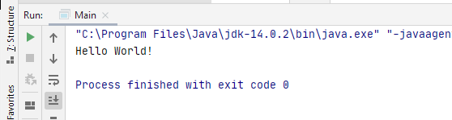
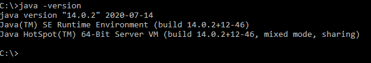
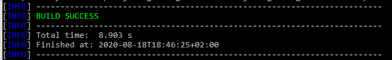
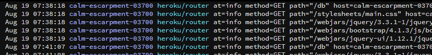

# DAT250
## Experiment Assignment 1 - Report

---

### Installation: Software Development Environment
I already had a functional installation of Java 8 and Eclipse that were frequently used in my Bachelor's degree - but I decided to also install Java 14 and IntelliJ to potentially try a different IDE.
Maven and git (both CLI and GitHub Desktop) were already installed and functional.

When installing Java I had some difficulties convincing my command line to use the newer version of Java instead of the old Java 8. I solved this by manually editing my PATH variable and moving the line pointing to the Java 14 directory to the top of the variable, above the references to Windows directories which apparently [contain a redirect to a previous installation](https://superuser.com/a/262761)

### Installation: Validating a working software development environment

For validating the installation of IntelliJ I ran a simple "Hello World!"-program. This also showed me Java 14 was working.

I also confirmed my command line could find Java by running ./java -version

Both Git and Maven had worked in previous assignments during my Bachelor's degree - but as they were both used during the tutorial for deploying on Heroku, I considered everything working during the tutorial as confirmation they still worked.

---

### Deploying to Heroku

When doing the tutorial for deploying Java applications on the Heroku cloud platform, I did encounter a problem with maven being unable to locate the Java SDK, during the [step involving compiling and deployment](https://devcenter.heroku.com/articles/getting-started-with-java#deploy-the-app).

This is what led me to discover the missing references in my PATH-variables as described above - and I also had to add an environment variable JAVA_HOME pointing to the Java directory. After this, everything compiled and deployed fine.

I next encountered a problem when using [add-ons to my Heroku application](https://devcenter.heroku.com/articles/getting-started-with-java#provision-add-ons) - despite visiting my app several times in different browsers including through [Opera's simple browser-VPN](https://www.opera.com/no/features/free-vpn), the Papertrail logging add-on did not show any activity.

However, after returning to the log a few hours later, the log showed several succesful GET-queries, from my previous visits.

I experienced no other problems, and my Heroku application is [deployed and available](https://calm-escarpment-03700.herokuapp.com/)
