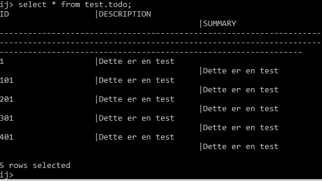
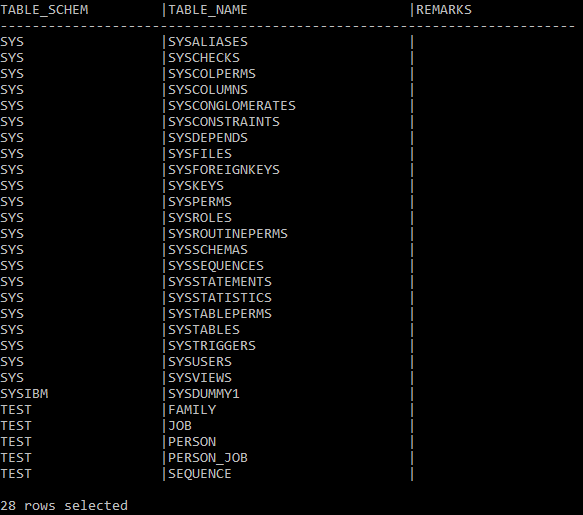
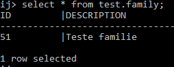
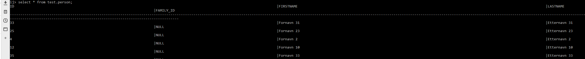
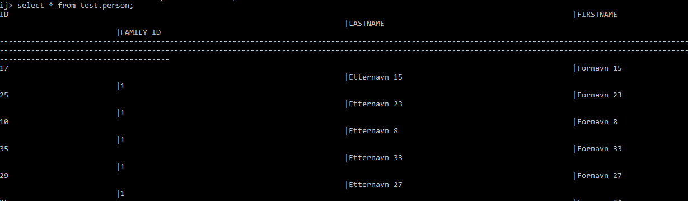
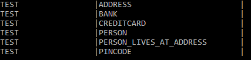
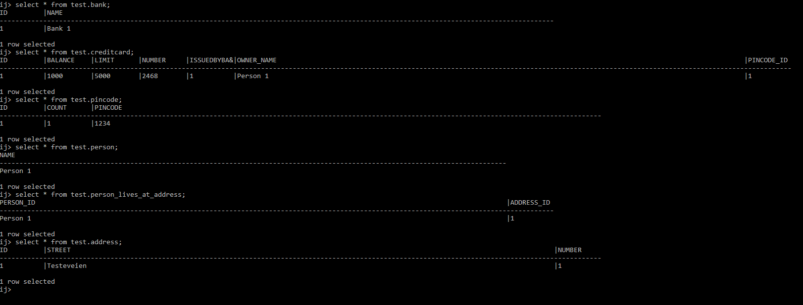

# DAT250
## Experiment Assignment 2 - Report

---

### Installation: Derby Database

I completed the Derby tutorial that was [linked in the assignment](http://db.apache.org/derby/papers/DerbyTut/index.html), without any issues. I created a table, inserted rows and updated a row.

---

### Experiment 1: Application using JPA

I chose not to use the given Maven project, but followed [the Vogella tutorial](https://www.vogella.com/tutorials/JavaPersistenceAPI/article.html#installation). I encountered some confusion when trying to add Derby and Eclipselink to the project's build path, and ended up downgrading my project's JRE to Java 1.8, which was more familiar to me.

The tutorial included creating a small Todo-entity which can be found in the included code, in the package [no.hvl.dat250.exp2.todo](https://github.com/krnome/DAT250-experiments/tree/master/exp2/src/no/hvl/dat250/exp2/todo).
Part of the experiment included inspecting the database tables - I chose to do this by logging into the database server from the command line.

The next steps included creating several entities with relations: Family, Person and Job. These classes can be found in the included code, in the package [no.hv.dat250.exp2.model](https://github.com/krnome/DAT250-experiments/tree/master/exp2/src/no/hvl/dat250/exp2/model).

Again, I inspected these tables by logging into the database server from the command line.

Table for the family entity

The tutorials include some JUnit tests. These tests seem unfinished, as one of them involve deleting a family member without merging it back, bringing the number of people down to 39 - and another test asserting that the number of people is still 40, that then ends up giving an AssertionError. I was at first satisfied that the test that checks the family size being 40 succeeded, as this would mean implementing relations had succeeded. However, when I inspected the database, all entities in the Person table showed their family as being null.

First 5 results from the person table - note FAMILY_ID is null for all of them

The test adds a person to the family's list of members and then persists the Person and re-persists the family. I instead changed this to setting the person's family-attribute to the family, as according to the JPA-implementation, the Person is the owning side of the relation. This correctly set the family column in the actual database.

---

### Experiment 2: 

For experiment 2, I tried to implement the domain model for banks that was introduced in the lecture videos.

This was done with surprisingly few problems - I have worked with JPA previously during some bachelor-level courses, and experienced several issues before the relations started working.
The code can be found in the included code, in the package [no.hvl.dat250.exp2.bank](https://github.com/krnome/DAT250-experiments/tree/master/exp2/src/no/hvl/dat250/exp2/bank)

I implemented a simple Main-class that inserts one instance of each class into the database, and inspected the database to verify that they were actually inserted.

This did cause some confusion. 

I had tried to implement the ManyToMany relation between Person and Address by using annotations explicitly naming a join table "person_lives_at_address", but this table was nowhere to be seen, and the relation was instead given by a generic 'person_address' table, and no relation between my one Person-object and my one Address-object had been established. This was also the case with some other relations I had set. After reviewing my code, I realized my mistake: I liked the concept described in the book's chapter 5, of setting annotations on an attributes get-method instead of directly on the attribute, so I used this for all the classes - but I consistently had not done this for the classes' Id-attribute. As the book also says:
> \[...] The behavior of an application that mixes the placement of annotations of fields and properties, without explicitly specifying the access type, is undefined.

I chose to move all the relations-annotations to the attributes themselves - and this caused relations to be established correctly in the database.

Tables for the bank domain model

All the inserted rows, including relations

After successfully implementing the domain model, the result is very similar to what I originally imagined last week. I did make some changes related to which entities were considered on the 'owning' side of the relation.
