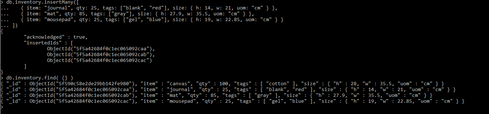
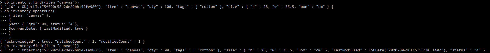

# DAT250
## Experiment Assignment 3 - Report
 
---

### Installation: MongoDB Database

I completed the MongoDb examples that were [linked to in the assignment](https://docs.mongodb.com/manual/tutorial/getting-started/), without any issues. I switched databases, inserted documents, and successfully selected all documents, then specific ones.

After downloading the MongoDB installation, but before performing the installation, I validated the package as instructed in the assignment, using the [public SHA256 signature file](https://fastdl.mongodb.org/windows/mongodb-windows-x86_64-4.4.0-signed.msi.sha256).

The documentation provided a Powershell script to perform the comparison - I modified this to look in the current directory, instead of '$Env:HomePath\downloads\[...]'. The hashes matched, and the MongoDB binary was considered verified.


The hashes match, and the result of '$sigHash -eq $fileHash' returns True.

I chose not to install MongoDB as a windows service, meaning I had to run the **mongod** server in a separate command window while working with the experiment. This worked without issues.

---

### Experiment 1: MongoDB CRUD operations

I followed the tutorials in the MongoDB documentation that were linked to in the assignment, without any issues.

This included:

Insert - shown is the insertMany instruction in the tutorial, and the find-operation shows the documents were inserted.


Query - shown is one of the examples in the tutorial, finding documents where status equals "A" **and** *either* qty is less than 30, *or* item starts with the character **p**


Update - shown is the item before the updateOne-operation, the updateOne-operation, and the document after the updateOne-operation


Remove - shown is the collection before any removals, after all items where status equals "A" are deleted, and again after one item where status equals "D" is deleted.


Bulk Write Operation - shown is the example in the tutorial. First, the collection with three documents, followed by the bulkWrite()-operation, and finally the updated collection.


### Experiment 2: Aggregation

I read the material linked to in the assignment, and completed the Map-Reduce examples, without any problems.

Shown is the second Map-Reduce from the tutorial, which finds order and total quantity per item, and average quantity ordered for each item.


The assignment also tasked us with adding an additional Map-Reduce operation.
I set out to implement a Map-Reduce operation showing the total amount each customer had purchased of each item. Ideally, I would have been able to make the operation return a collection of cust_id with collections consisting of \( item_sku, total_item_qty \) tuples for all items, but this turned out to be difficult. I instead implementing an operation returning a collection of {key_cust, item_sku} tuples as the \_id value, for each combination of customers and item names, and total_item_qty as the value.

The operation:
```javascript
var mapFunction5 = function(){
	for(var i = 0; i < this.items.length; i++) {
		var key_cust = this.cust_id;
		var key_itemName = this.items[i].sku;
		var key = {key_cust: key_cust, key_item: key_itemName}
		var qty = this.items[i].qty;
		
		emit(key, qty);
	}
};

var reduceFunction5 = function(key, value) {
	return Array.sum(value);
	
};

db.orders.mapReduce(
	mapFunction5,
	reduceFunction5,
	{
		out: "teste5" 
	}
)
```

The results:


In the end, what I imagined as the ideal result may not be very different, and the actual result I got may be easier to use for expansions such as finding the item a customer has purchased most or least, which could theoretically be used for personalized ads in attempts to encourage the user to buy more of items the theoretical store knows they already buy some amount of - or when increasing the store's selection, one could use this Map-Reduce operation to find users that buy several of similar products, to target them with ads for the new product.

The Map-Reduce operation as it is maps **qty** to the pair of {cust_id, sku}. For example, the customer "Ant O. Knee" has two orders in the collection - the first order contains "oranges" and "apples", and the second order contains "oranges" and "chocolates. This makes for four different "lines" - but the operation groups together instances that are identical - in this case, the two instances of "Ant O. Knee" buying oranges. The Reduce-function then receives three different combinations for the customer, and sums all the values found in the "value" parameter - in this case, arrays containing the amounts bought of that specific item, per order. The final result shows all combinations of customers and items, and how many that customer has bought of that item, in total.


