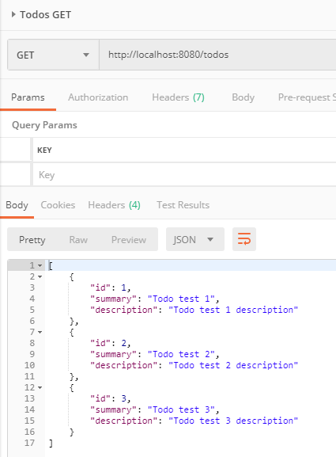
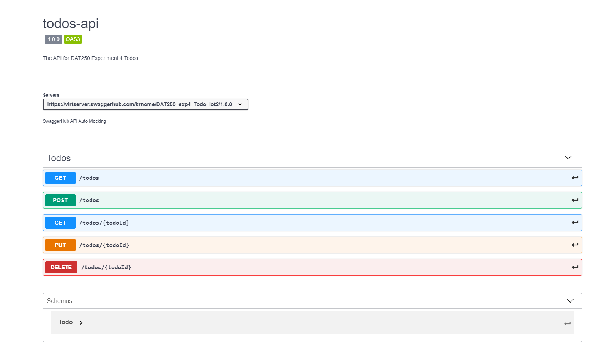

# DAT250
## Experiment Assignment 4 - Report

---

### Experiment 1: Spark/Java Framework project and Postman

I cloned the Counters-example [given in the assignment](https://github.com/selabhvl/dat250-sparkjava-counter), and used the included GetRequest- and PutRequest-classes to check that the service was deployed and operational.

I then used Postman to test the counter service, which worked without issues.

### Experiment 2: REST API for TODO-items

I used the Todo-class from [Experiment 2](https://github.com/krnome/DAT250-experiments/tree/master/exp2) to implement a REST API to enable CRUD-operations to a local Derby-database.

The implementation can be found in the included code, in the package [no.hvl.dat250.exp4.todo](https://github.com/krnome/DAT250-experiments/tree/master/exp4/todos/src/main/java/no/hvl/dat250/exp4/todo).

I changed the GetRequest- and PutRequest-classes that were included for the Counters-example to work with Todos, and used them to also implement a PostRequest-class, to confirm that the service worked as expected. I also tested the four operations in Postman.

Postman: Get-request after two Todos were saved:

Postman: Post-request, returning the Todo in JSON:

Postman: Get-request after the previous Post-request:

Postman: Get-request for specific Todo:

Postman: Put-request for specific Todo - returns the updated Todo in JSON:

Screenshot from the Derby database confirming the JPA implementation works:

Postman: Get all Todos after the Put-request:

Postman: Delete-request for specific Todo:

Postman: Get-request after the Delete-request:

### Experiment 3: Swagger

I investigated how Swagger could be used to specify the REST API. After some Googling, I have the impression that Swagger does not naturally support APIs made with the Spark framework without some extra work. The solutions I found involves either [using JAX-RS annotations and changing the routes to seperate classes to make the Swagger tools able to discover the routes by itself](https://serol.ro/posts/2016/swagger_sparkjava/), or using  [unofficial extensions](https://github.com/manusant/spark-swagger) to let Swagger generate definitions.

As the experiment asked us to *try to investigate*, I have not implemented any of these. I instead experimented with manually creating a Swagger specification on [SwaggerHub](https://app.swaggerhub.com/). 

The result can be [seen on SwaggerHub](https://app.swaggerhub.com/apis/krnome/DAT250_exp4_Todo_iot2/1.0.0), and the exported JSON API can be found [in this repository](https://github.com/krnome/DAT250-experiments/blob/master/exp4/krnome-DAT250_exp4_Todo_iot2-1.0.0-resolved.json)

I have not implemented this specification actually being accessible from the running Jetty server, but I was able to make the API viewable in [Swagger's tools](https://app.swaggerhub.com/apis/krnome/DAT250_exp4_Todo_iot2/1.0.0), for an impression of what that would look like:

Overview of the API:

Get-requests for specific todos:

### Experiment 4: XML representation

As with experiment 3, the assignment is to *investigate*. This, combined with the experiment being marked as optional led me to choose not to actually implement returning and consuming XML resource representations of the Todo-items.

I did, however, try to investigate how this would be done. 

When searching for information, it was easy to get lost in references and questions about Apache Spark servers, which are not related to the Java Spark framework.

From actually relevant sources, it seems implementing XML representation would not be too *complicated*, but it would involve more work and more code lines than simply using Gson to marshall and unmarshall between JSON and Java objects. For example, using [the Java JAXB architecture](https://docs.oracle.com/javase/tutorial/jaxb/intro/index.html) would involve annotating the Todo-object and its' attributes to map them to an appropriate XML schema for Todos before doing any marshalling and unmarshalling.

There are [other XML parsers](https://www.tutorialspoint.com/java_xml/index.htm) for Java that could be used, but my initial impressions say using these would involve manually creating a new Todo and manually parsing and setting each attribute when consuming an XML resource, which would be even more work.

When consuming, I assume the XML resource would be a part of the request's body which should not demand any special consideration for the Spark framework - and when returning a resource, the response.type() would have to be set to "text/xml" instead of the default "application/json" that was setup in the given Counters-example.
