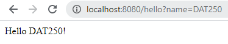
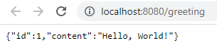

# DAT250
## Experiment Assignment 5 - Report

---

### Experiment 1: Getting started

I completed the quickstart-guide [linked to in the assignment](https://spring.io/quickstart), which involved creating a simple Spring Boot REST-application that exposed a single \/hello endpoint, returning "Hello World!" or "Hello \[name given as request-parameter\]. The code is included in the folder [1-gettingStarted](1-gettingStarted).

defaultValue:

 

Name given as request parameter:

### Experiment 2: Spring Boot

I completed the tutorial on Spring Boot that was [linked to in the assignment](https://spring.io/guides/gs/spring-boot/), which involved creating another simple Spring Boot REST-application that exposed a single \/hello endpoint - but also with an added Actuator model and an introduction to JUnit tests using Spring's MockMvc functionality, and Spring's ability to test the full-stack integration. The code is included in the folder [2-springBoot](2-springBoot)

Output in a browser from the application:

 

Output from the web application in the console, showing some of the active Beans that were automatically added by Spring Boot:

Results of the JUnit tests:

Output in browser from the /actuator/health endpoint exposed by the actuator:

### Experiment 3: REST service

I completed the REST-app tutorial that was [linked in the assignment](https://spring.io/guides/gs/rest-service/). This again included creating a simple REST-application - but this time also implementing using a Greeting resource to expose Greeting endpoints. The code is included in the folder [3-rest](3-rest).

Output in browser after a get-request without parameters, returning a Greeting resource with default content:

Output in browse after a get-request that includes a parameter:

### Experiment 4: Data Access

I completed the JPA-tutorial that was [linked in the assignment](https://spring.io/guides/gs/accessing-data-jpa/). This involved using Spring to create a simple application that uses JPA to persist data. As a database, the application uses an embedded H2-database, that was included as a Maven-dependency when generating the project's code in the [Spring initializr](https://start.spring.io/). The application uses a simple Customer-entity. I especially enjoyed creating a simple interface for accessing the database, that did not actually have to be implemented by a class, but was created by Spring Data JPG when running the application. For "testing" the database, the application creates five Customer-entities that are persisted to the H2-database, and uses three different methods for selecting entities. The code is included in the folder [4-jpa](4-jpa)

Output in console from the application, showing results from the find-operations:

### Conclusion

All tutorials were completed. I did not experience any technical problems during the tutorials.

The tutorials should prove useful when doing Design and Prototyping Assignment B.