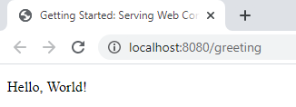
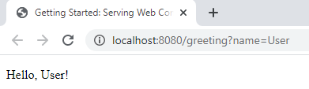
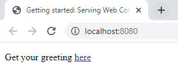
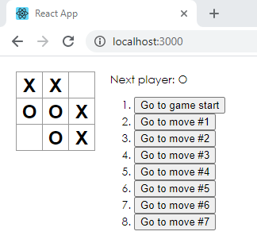

# DAT250
## Experiment Assignment 6 - Report

---

### Experiment 1: MVC Web Applications

I completed the tutorial on Spring MVC that was [linked to in the assignment](https://spring.io/guides/gs/serving-web-content/). The code can be seen in this repository, [in the folder 1-mvc](1-mvc). I did not experience any technical difficulties.

This tutorial was similar to the web applications that were made as part of Experiment Assignment 5, but this tutorial involved explicitly using a Controller, a Model and a View.
The simple ```@Controller```-class exposed a `/greeting` GET-endpoint that served a View that was implemented by using Thymeleaf. A very simple Model was used that only contained the attribute `name`, which was set up in the Controller and made available to the View.

Initial View in browser, using the default value "World!" added to the Model:



Using a parameter in the query, adding the parameter to the Model's `name`instead of the default value:



The tutorial then added a static `index.html` - as I understood it, to demonstrate Spring Boot Devtools and its ability to speed up the cycle of changing code, restarting the application, and refreshing the browser. I was slightly confused by this part, as I didn't see any change after saving my newly added `index.html`, even manually browsing to the page on my local server. Looking at [the documentation](https://docs.spring.io/spring-boot/docs/current/reference/htmlsingle/#howto-hotswapping), it seems this process automatically happens when using Eclipse, but as I was using IntelliJ I had to "manually" trigger a restart of the application by selecting Build -> Build project in the menus. This triggered a quick server restart that was similar in speed to what I have previously experienced when changing a static resource in Eclipse, in web applications I made in previous Bachelor level courses. 




### Experiment 2: Single-page Web Applications

I completed the tutorial on the React framework that was [linked to in the assignment](https://reactjs.org/tutorial/tutorial.html). The code can be seen in this repository, [in the folder 2-spa](2-spa). **NOTE**: I chose not to upload the applications `node_modules`-folder, as this was 160MB, containing over 42 000 files. Please let me know if this is required, and I will add it to the repository.

In the tutorial, I completed a simple Tic-Tac-Toe game by using React. 

I chose to use [Jetbrains' WebStorm](https://www.jetbrains.com/webstorm/) to do the tutorial. I experienced some technical difficulties when getting started. WebStorm downloaded and prepared Node.js when creating a new Project - but executing `npx create-react-app my-app` as the tutorial asked proved difficult, as the terminal in the IDE would not recognize npm or Node.js - and when it did, by using ctrl+enter to execute the command using the IDE instead of the "regular" terminal, npm did not find a reference to the Node.js-installation, or refused to accept parameters to the execution. After some Googling, I found I had to create and run once a new Run Configuration that made npm automatically prepend the path to the installed Node.js configuration: `npm config set scripts-prepend-node-path auto`. After this, I could create the react app without any problems, and did not experience any further technical difficulties.   

When doing the tutorial, I followed the tutorial's advice of typing the code by hand instead of using copy/paste. This did help me think through exactly what I was actually typing, which probably helped me understand what I was doing a little bit more than if I had just copied - but after finishing the tutorial I can't fully say I feel confident in my React-abilities - but hopefully this will improve with some more practice. I at least understood the concept of components and props, and a component having a state.

Image showing the completed tic-tac-toe game with a history of moves:

