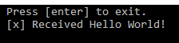
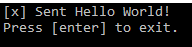
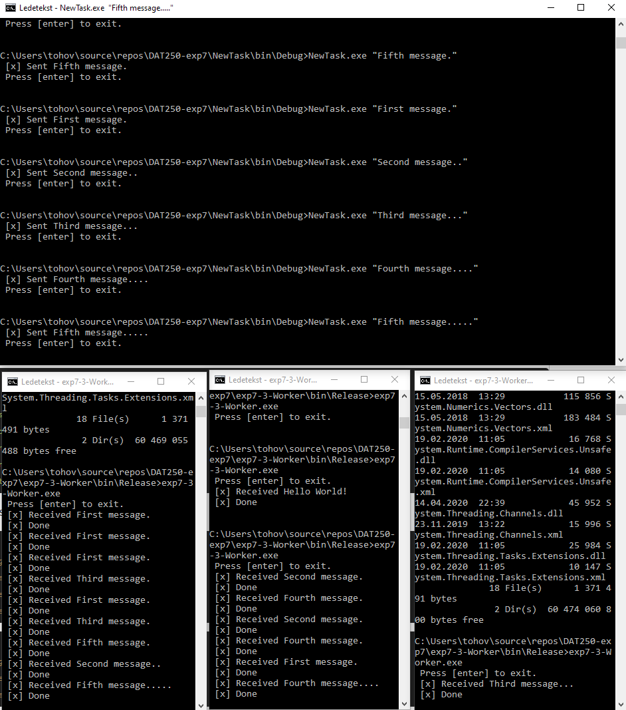
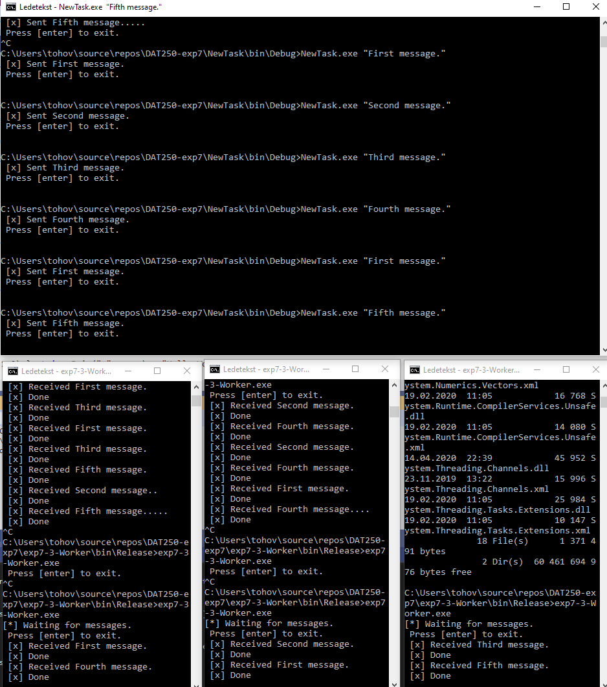

# DAT250
## Experiment Assignment 7 - Report

---

### Experiment 1 - Installation

I followed the instructions for installing RabbitMQ on Windows, which also included installing Erland. I experienced no technical difficulties.

---

For the reset of the tutorials, we were free to choose the programming language. I chose to do them in C#.

### Experiment 2 - Hello World

I completed the "Hello World!" [tutorial for C#](https://www.rabbitmq.com/tutorials/tutorial-one-dotnet.html). I set up a simple Producer class that sent "Hello World" to RabbitMQ, and a simple Consumer that received the message from RabbitMQ.

I made the "mistake" of creating my projects in Visual Studio, which can't directly run several instances of the same process - and I also created them as .NET Framework apps which meant I couldn't use ```dotnet run``` as the tutorial instructed, as that command seems to be part of .net Core.

I worked around this by building the projects in Visual Studio, and manually opening different command line windows where I then executed the compiled programs. This was a little cumbersome, but worked fine. The code can be seen in this repository, in the folders for [the Send program](DAT250-exp7/DAT250-exp7) - the producer - and [the Receive program](DAT250-exp7/DAT250-exp7-Receive) - the consumer.

Screenshot of the Consumer program - Receive.exe - that was run before the Producer program. Screenshot taken after the Producer was run.



Screenshot of the Producer program - Send.exe - that was run after starting the Consumer.



### Experiment 3 - Queue Messaging

I completed the [tutorial on Work Queues for C#](https://www.rabbitmq.com/tutorials/tutorial-two-dotnet.html). In the tutorial I first set up a queue using a round-robin distribution for messages. Following the tutorial, I then modified the programs to use manual message acknowledgement and marking messages as Persistent, and using Fair Dispatch instead of round robin distribution. I was unable to properly take advantage of this as for example the first consumer was done with "processing" the first message by the time I managed to send message number two and so on - but in hindsight, I realize I probably could have added lots of periods to the messages I sent to simulate long processing times, as the consumers as implemented in the tutorial do Thread.Sleep() based on how many periods are in the message it receives.

Again, it was a little cumbersome to run the different processes - especially the consumer producing five different messages, but it worked without any technical issues. The code can be seen in this repository, in the folders for [the NewTask program](DAT250-exp7/NewTask) - the producer - and [the Worked program](DAT250-exp7/exp7-3-Worker) - the consumer.

Screenshot showing the Producer -  NewTask.exe - at the top, and three different Consumers - Worker.exe receiving messages one by one, in round robin distribution. The screenshot ended up a little messy, as the first and second consumers received several messages before I started the third process. However, the round robin distribution can be seen in the last few messages, as process #2 receives 'First message' before process #1 receives 'Second message' before process #3 receives 'Third message'.



Screenshot showing fair dispatch - although as I said, I was unable to properly "take advantage" of the functionality.


### Experiment 4 - Publish/Subscribe

I completed the [tutorial on Publish/Subscribe for C#](https://www.rabbitmq.com/tutorials/tutorial-three-dotnet.html). In the tutorial I set up a named Exchange that used ```ExchangeType.Fanout``` to broadcast messages to all the queues the Exchange knows about, to implement a sort of logger. The code can be seen in this repository, in the folders for [the EmitLog program](DAT250-exp7/exp7-4-EmitLog) - the producer, and for [the ReceiveLogs program](/DAT250-exp7/exp-7-4-ReceiveLogs) - the consumer.

The two consumers created "their own" non-durable, exclusive queues that are deleted when the consumers disconnect from RabbitMQ. The queues establish a relationship to the exchange through a *binding* by calling ```channel.QueueBind()```. By following the tutorial, I started one consumer that wrote to a log file, and a second consumer that printed incoming messages. When repeatedly executing the Producer with different arguments, the two consumers received the messages at the same time.

Screenshot showing the producer on the top right, sending five messages to the exchange - and a consumer that prints messages on the top left, and a consumer that prints to a log file on the bottom right. The log file can be seen on the bottom right.

[Publish/Subscribe](img/4-logCommandWindows.PNG)

Screenshot showing the different bindings and queues that were created throguh all tutorials, while the two consumers from the last experiment are still active, as can be seen by two queues having randomly generated names.
[Bindings and queues](img/4-bindings.PNG)